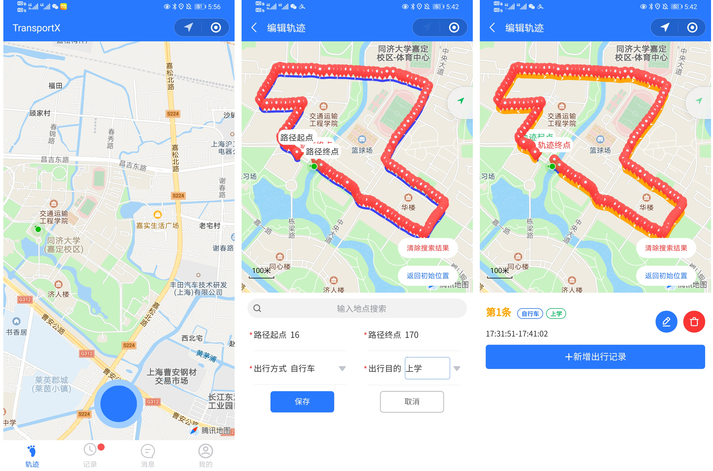
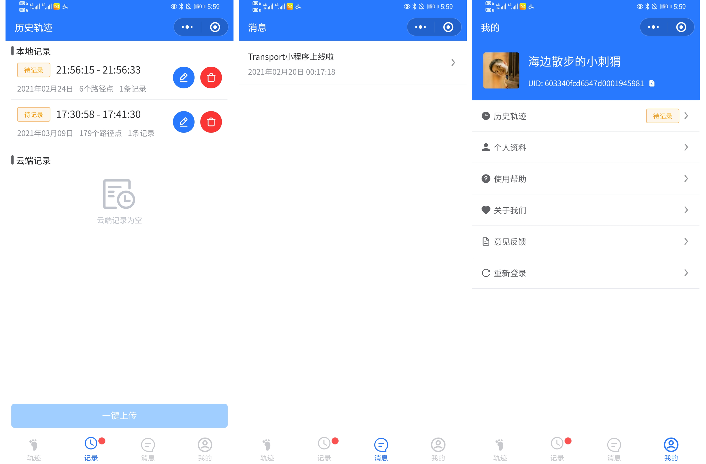
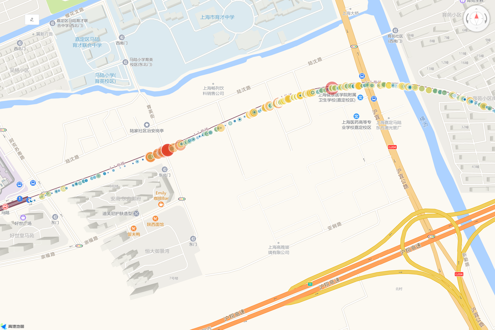

# TransportX：个体交通出行链数据采集轻量化平台

## 功能简介

TransportX——个体交通出行链数据采集、交通舒适度评价与城市风险治理的分布式、高精度、细粒度解决方案。

5G通信与北斗导航赋能，人工智能与数据挖掘加持，云计算与物联网助力，分布节点与全民参与聚智，为智能交通提供全息感知便携式解决方案，为城市大脑提供数据驱动底层支持，将论文写在祖国大地上。

官方网站：https://github.com/TommyZihao/TransportX

## 使用界面

## 开发团队

蒋烜：科研方向制定、功能流程设计、调试迭代更新

熊子曰：产品经理、UI设计、用户表单设计

杨耀东：微信小程序、前后端接口、数据库、地图组件开发

张子豪：文档手册撰写、地理信息数据挖掘

李健：科研指导老师、产品战略与推广制定

同济大学交通科学与技术研究院

同济大学道路与交通工程教育部重点实验室

同济大学交通运输工程学院

## 功能特性

随着移动互联网、物联网、云计算、5G通信、北斗导航、嵌入式智能硬件等新基建数字网络不断完善，调用智能手机中的定位模块、加速度计、陀螺仪、麦克风等传感器，即可对个体出行链全过程的交通方式、出行轨迹、时间、交通舒适度、车辆平顺性、卫星环境等数据进行便携、高频、高精度采集。

智能手机中的卫星定位模块，通过卫星定位系统解算经纬度与海拔高度，主流智能手机都已支持美国GPS、俄罗斯格洛纳斯、中国北斗导航、欧盟伽利略等GNSS系统。我国自主研发的北斗三号导航系统已于2020年完成组网。定位精度从几十米提升至亚米级，并针对亚太地区的定位系统做了信号增强。

- 便携零成本：微信小程序无需下载安装，兼容安卓苹果，有网有微信即可使用。扫点即开，打开即用，用完即走。
- 并行分布式：每位市民都可成为交通出行链数据采集终端，为大数据公众治理与众创集智提供基础平台。
- 定位细粒度：5G通信和北斗导航加持下，可达到亚米级别的定位精度。基于Web GIS技术绘制交互式数据大屏。图表类型支持气泡图、热力图、聚类图、等值线图、时序图等。
- 频率可调整：用户可设置采集频率每秒一次到若干秒一次不等，满足不同测试场景的数据需求。
- 全链数据全：公交、骑行、汽车、步行、飞机、地铁，包含各类地理信息、传感器信息、测试者信息。
- 耦合多维度：采集得到的数据反映了交通出行方式、测试者信息、交通舒适度多维信息，便于后续特征工程与多维度耦合数据挖掘。
- 升级可扩展：随着移动互联网、北斗导航、5G通信、物联网、传感器、室内定位等新基建技术飞速发展，智能手机内置的传感器种类和性能会越来越高，未来将增设温度、湿度、红外、激光雷达等传感器，还可结合智能手环、智能手表、无线耳机采集的心率、血压、主动降噪等数据，构建更多维度的舒适度评价体系。

- 实时通信快：智能手机具备实时网络通信功能，可在异常值出现时第一时间传回后台。

## 使用帮助

首次使用配置：

- 设置-通知管理-接受通知
- 设置-位置信息-使用时和离开后
- 我的-个人资料-填写个人资料

采集轨迹

- 轨迹-点击开始按钮-开始记录，点击结束按钮-停止记录

- 使用时请勿关闭微信和本小程序，可以悬浮窗形式后台运行

采集结束

- 记录轨迹起点和终点
- 一键上传

## 细粒度交通出行链挖掘

## 用户反馈与建议

503440616@qq.com

## 参考文献

[1]Andrade, Thiago, and João Gama. "Identifying points of interest and similar individuals from raw GPS data." EAI International Conference on Smart Cities within SmartCity360° Summit. Springer, Cham, 2018.

[2]Zheng, Yu, et al. "Mining interesting locations and travel sequences from GPS trajectories." Proceedings of the 18th international conference on World wide web. 2009.

[3]Lee, Youngseol, and Sung-Bae Cho. "Extracting meaningful contexts from mobile life log." International Conference on Intelligent Data Engineering and Automated Learning. Springer, Berlin, Heidelberg, 2007.

[4]Guo, Tao, Kazuaki Iwamura, and Masashi Koga. "Towards high accuracy road maps generation from massive GPS traces data." 2007 IEEE international geoscience and remote sensing symposium. IEEE, 2007.

[5]Marra, Alessio D., et al. "Developing a passive GPS tracking system to study long-term travel behavior." Transportation research part C: emerging technologies 104 (2019): 348-368.

[6]Zheng, Yu, et al. "Understanding mobility based on GPS data." Proceedings of the 10th international conference on Ubiquitous computing. 2008.

[7]Zheng, Yu, et al. "Learning transportation mode from raw gps data for geographic applications on the web." Proceedings of the 17th international conference on World Wide Web. 2008.

[8]Ekpenyong, Frank, Dominic Palmer-Brown, and Allan Brimicombe. "Extracting road information from recorded GPS data using snap-drift neural network." Neurocomputing 73.1-3 (2009): 24-36.

[9]Stanojevic, Rade, et al. "Robust road map inference through network alignment of trajectories." Proceedings of the 2018 SIAM International Conference on Data Mining. Society for Industrial and Applied Mathematics, 2018.

[10]沈振宇. 基于智能手机传感器的用户地铁轨迹推测[D].南京大学,2016.

[11]韩旭. 基于手机加速度传感器数据的交通出行方式识别方法研究[D].西南交通大学,2016.

[12]张杰峰. 基于智能手机的出行方式识别系统的设计和实现[D].华南理工大学,2016.

[13]姚振兴. 基于手机传感器数据的个体交通出行链信息采集方法研究[D].西南交通大学,2018.
